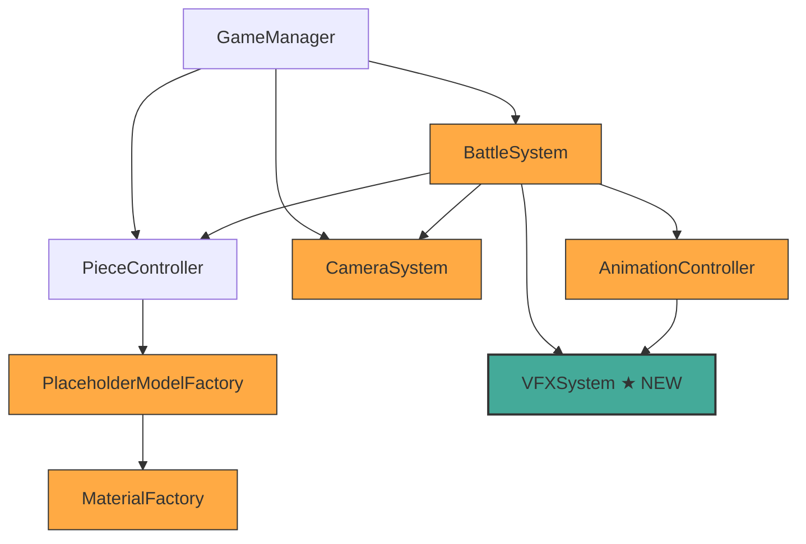
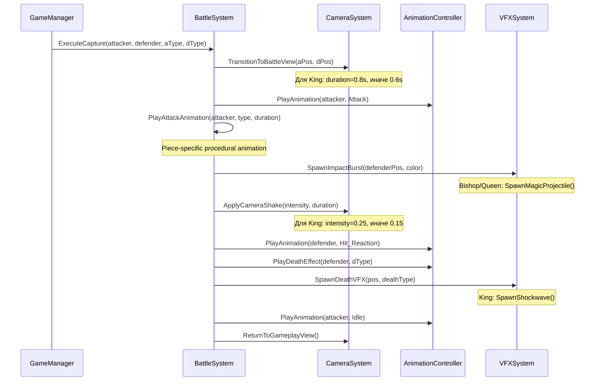

# Design Document: Epic Chess Visuals

## Overview

Данный дизайн описывает архитектуру и подход к реализации визуальных улучшений для Wizard Chess: детализированные процедурные модели фигур, улучшенные материалы с emission-эффектами, эпичные анимации атаки и смерти для каждого типа фигуры, система визуальных эффектов (VFX) на основе ParticleSystem, и улучшенная боевая камера.

Все изменения расширяют существующие классы (`PlaceholderModelFactory`, `MaterialFactory`, `BattleSystem`, `AnimationController`, `CameraSystem`) без изменения их публичных API. Новый класс `VFXSystem` добавляется для управления частицами. Все 3D-модели и эффекты создаются процедурно из Unity-примитивов и ParticleSystem — без внешних ассетов.

Проект использует Unity 6 (6000.4.1f1) с URP. Целевые платформы включают мобильные устройства, поэтому все визуальные улучшения имеют мобильные ограничения (лимиты на smoothness, metallic, emission, количество частиц).

## Architecture

### Высокоуровневая архитектура

Система визуальных улучшений интегрируется в существующую архитектуру через расширение текущих классов и добавление одного нового компонента:



Оранжевые блоки — модифицируемые классы. Зелёный блок — новый класс.

### Поток данных при взятии фигуры (Battle Sequence)



### Принципы проектирования

1. **Расширение без изменения API**: Все публичные сигнатуры сохраняются. `CreatePieceModel()`, `ExecuteCapture()` — без изменений.
2. **Процедурная генерация**: Все модели и VFX создаются из кода, без prefab-ассетов.
3. **Мобильная оптимизация**: Каждая подсистема проверяет `MaterialFactory.IsMobile()` и применяет ограничения.
4. **Единая ответственность**: VFX выделен в отдельный класс. Модели — в фабрике. Анимации — в контроллере.


## Components and Interfaces

### 1. PlaceholderModelFactory (модифицируется)

**Файл:** `Assets/Scripts/Pieces/PlaceholderModelFactory.cs`

**Изменения:** Полная переработка методов `Build{PieceType}()` для создания детализированных моделей из большего количества примитивов. Публичный API (`CreatePieceModel`, `ApplyColor`, `AddRaycastCollider`, `RemoveChildColliders`) не меняется.

**Новые требования к моделям:**

| Тип фигуры | Мин. примитивов | Ключевые элементы |
|---|---|---|
| Pawn | 6 | Base, Body, ShoulderArmor, Head, Helmet, Spear |
| Rook | 8 | Base, BodyLower, BodyUpper, Merlon×4, Platform |
| Knight | 8 | Base, HorseBody, Neck, Head, Muzzle, EarL, EarR, Mane |
| Bishop | 8 | Base, RobedBody, Head, Mitre, Staff, StaffOrb, ShoulderCapeL, ShoulderCapeR |
| Queen | 10 | Base, Body, Neck, Head, CrownRing, CrownPoint×4, Orb |
| King | 10 | Base, Body, Head, Crown, CrossV, CrossH, PauldronL, PauldronR, SwordBlade, SwordGuard |

**Ограничение:** Максимум 15 примитивов на фигуру для мобильной производительности.

**Категоризация частей для материалов:**
- `Base`, `Body`, `Head`, `Neck` и подобные → base material
- `Crown`, `CrossV`, `CrossH`, `Mitre`, `Orb`, `CrownPoint*`, `CrownRing` → accent material
- `Spear`, `Staff`, `SwordBlade`, `SwordGuard` → weapon material
- Остальные (`ShoulderArmor`, `Helmet`, `Mane`, `Muzzle`, `Pauldron*`, `ShoulderCape*`, `EarL`, `EarR`, `Merlon*`, `Platform`) → base material

### 2. MaterialFactory (модифицируется)

**Файл:** `Assets/Scripts/Visual/MaterialFactory.cs`

**Изменения:** Добавление emission glow к accent-материалам. Добавление мобильных ограничений при создании материалов.

**Новые/изменённые методы:**

```csharp
// Существующие методы — добавляется emission:
public static Material CreateWhitePieceAccentMaterial()
// → Добавить: EnableKeyword("_EMISSION"), SetColor("_EmissionColor", WhiteBlueGlow * 0.3f)

public static Material CreateBlackPieceAccentMaterial()
// → Добавить: EnableKeyword("_EMISSION"), SetColor("_EmissionColor", BlackRedPurpleGlow * 0.3f)

// Новый вспомогательный метод:
private static void SetEmission(Material mat, Color emissionColor, float intensity)
// → Устанавливает _EMISSION keyword и _EmissionColor с учётом intensity

// Модификация CreateStandardMaterial():
// → Если IsMobile(), автоматически вызывать ApplyMobileCaps()
```

**Emission параметры:**
- White accent: `WhiteBlueGlow (0.4, 0.6, 1.0)` × intensity 0.3
- Black accent: `BlackRedPurpleGlow (0.8, 0.2, 0.5)` × intensity 0.3
- Мобильные ограничения: smoothness ≤ 0.5, metallic ≤ 0.3, emission intensity ≤ 0.3

### 3. VFXSystem (новый класс)

**Файл:** `Assets/Scripts/Visual/VFXSystem.cs`

**Назначение:** Создание и управление runtime-частицами для боевых эффектов. Все ParticleSystem создаются программно без prefab-ассетов.

```csharp
namespace WizardChess.Visual
{
    public class VFXSystem : MonoBehaviour
    {
        // Impact burst при ударе
        public void SpawnImpactBurst(Vector3 position, Color color, int particleCount = 12);
        
        // Magic projectile trail (Bishop, Queen)
        public GameObject SpawnMagicProjectile(Vector3 from, Vector3 to, float duration, Color color);
        
        // Death debris particles
        public void SpawnDeathDebris(Vector3 position, DeathVFXType type, Color color);
        
        // King shockwave ring
        public void SpawnShockwave(Vector3 position, float radius = 2f, float duration = 0.5f);
        
        // Auto-cleanup
        private IEnumerator DestroyAfterLifetime(GameObject vfxObj, float lifetime);
    }
}
```

**Типы VFX для смерти:**
```csharp
public enum DeathVFXType
{
    StoneFragments,    // Rook, Pawn (Stone Break)
    MagicSparkles,     // Bishop (Magic Dissolve)
    CombinedDebris,    // Queen (Magic Dissolve + Stone Break)
    KingShockwave      // King (dramatic)
}
```

**Параметры частиц:**

| Эффект | Кол-во частиц | Lifetime | Размер | Скорость |
|---|---|---|---|---|
| Impact Burst | 12 (mobile: 6) | 0.3–0.8s | 0.05–0.15 | 1–3 |
| Magic Projectile | trail: 20 (mobile: 10) | duration | 0.08 | по направлению |
| Stone Fragments | 15 (mobile: 8) | 0.5–1.0s | 0.03–0.1 | 1–4 |
| Magic Sparkles | 20 (mobile: 10) | 0.4–0.8s | 0.02–0.06 | 0.5–2 |
| Shockwave Ring | 1 (ring mesh) | 0.5s | 0→2 radius | расширение |

**Мобильные ограничения:** Количество частиц × 0.5, отключение коллизий частиц.

### 4. BattleSystem (модифицируется)

**Файл:** `Assets/Scripts/Battle/BattleSystem.cs`

**Изменения:** Интеграция VFXSystem в боевую последовательность. Добавление вызовов VFX в нужные моменты анимации. Специальная обработка King captures (увеличенная длительность камеры, усиленный shake).

**Новые зависимости:**
```csharp
[SerializeField] private MonoBehaviour vfxSystemComponent;
private VFXSystem _vfxSystem; // или через интерфейс
```

**Модификации `ExecuteCapture()`:**
- После attack animation impact → `_vfxSystem.SpawnImpactBurst(defenderPos, color)`
- Для Bishop/Queen attack → `_vfxSystem.SpawnMagicProjectile(attackerPos, defenderPos, duration, color)`
- При death effect → `_vfxSystem.SpawnDeathDebris(defenderPos, deathType, color)`
- Для King death → `_vfxSystem.SpawnShockwave(defenderPos)`
- Для King capture: camera transition duration = 0.8s, shake intensity = 0.25

### 5. AnimationController (модифицируется)

**Файл:** `Assets/Scripts/Animation/AnimationController.cs`

**Изменения:** Минимальные. Существующие death effect coroutines уже реализованы корректно. Основное изменение — гарантия восстановления Transform после не-death анимаций.

**Гарантия восстановления Transform:**
- `AttackAnimationCoroutine` — уже восстанавливает position в конце
- `HitReactionCoroutine` — уже восстанавливает position в конце
- Добавить явное восстановление `localScale` в `AttackAnimationCoroutine` и `HitReactionCoroutine` если они были изменены

### 6. CameraSystem (модифицируется)

**Файл:** `Assets/Scripts/Camera/CameraSystem.cs`

**Изменения:** Добавление поддержки специальных параметров для King captures.

**Новые/изменённые методы:**
```csharp
// Перегрузка с настраиваемой длительностью перехода:
public IEnumerator TransitionToBattleView(Vector3 attackerPos, Vector3 defenderPos, float customDuration);

// Существующий ApplyCameraShake уже поддерживает произвольные intensity/duration
```

**King-специфичные параметры:**
- Transition duration: 0.8s (вместо стандартных 0.6s)
- Shake intensity: 0.25 (вместо стандартных 0.15)
- Shake duration: 0.25s (без изменений)


## Data Models

### Существующие типы (без изменений)

```csharp
// ChessTypes.cs — без изменений
public enum PieceType { Pawn, Rook, Knight, Bishop, Queen, King }
public enum PieceColor { White, Black }

// AnimationTypes.cs — без изменений
public enum ChessAnimationState { Idle, Move, Attack, Hit_Reaction, Death }
public struct BattleConfig { float MinDuration; float MaxDuration; }
public struct AttackStyle { PieceType AttackerType; string AnimationName; string Description; }
```

### Новые типы

```csharp
// В VFXSystem.cs или отдельном файле VFXTypes.cs
public enum DeathVFXType
{
    StoneFragments,
    MagicSparkles,
    CombinedDebris,
    KingShockwave
}
```

### Маппинг PieceType → DeathVFXType

| PieceType | DeathEffectType (AnimationController) | DeathVFXType (VFXSystem) |
|---|---|---|
| Pawn | HeavyImpactFall | StoneFragments |
| Rook | StoneBreak | StoneFragments |
| Knight | HeavyImpactFall | StoneFragments |
| Bishop | MagicDissolve | MagicSparkles |
| Queen | MagicDissolvePlusStoneBreak | CombinedDebris |
| King | KingDramatic | KingShockwave |

### Маппинг PieceType → минимальное количество примитивов

| PieceType | Мин. примитивов | Макс. примитивов |
|---|---|---|
| Pawn | 6 | 15 |
| Rook | 8 | 15 |
| Knight | 8 | 15 |
| Bishop | 8 | 15 |
| Queen | 10 | 15 |
| King | 10 | 15 |

### Параметры материалов

```
White Base:    RGB(0.90, 0.85, 0.75), smoothness=0.4, metallic=0.05
White Accent:  RGB(0.85, 0.75, 0.30), smoothness=0.8, metallic=0.6, emission=RGB(0.4,0.6,1.0)*0.3
White Weapon:  RGB(0.85, 0.75, 0.30), smoothness=0.7, metallic=0.5

Black Base:    RGB(0.20, 0.15, 0.20), smoothness=0.45, metallic=0.1
Black Accent:  RGB(0.50, 0.50, 0.55), smoothness=0.85, metallic=0.7, emission=RGB(0.8,0.2,0.5)*0.3
Black Weapon:  RGB(0.50, 0.50, 0.55), smoothness=0.75, metallic=0.6

Mobile caps:   smoothness≤0.5, metallic≤0.3, emission≤0.3
```

### Параметры анимаций атаки

| PieceType | Lunge/Move dist | Scale mult | Phase split (attack/return/recover) |
|---|---|---|---|
| Pawn | 0.5 forward | 1.0 | 40% / 60% / — |
| Rook | -0.3 back, +0.8 forward | 1.15 | 40% / 30% / 30% |
| Knight | -0.8 back, +1.2 forward | 1.0 (bounce 0.15) | 30% / 40% / 30% |
| Bishop | 0 (stationary) | 1.25→1.4 pulse | 50% / 30% / 20% |
| Queen | 0.6 forward (melee) | 1.35 pulse (magic) | 30%+15% / 30% / 25% |
| King | +0.5 up, +0.7 forward | 1.1 | 40% / 30% / 30% |

### Параметры камеры

```
Standard battle:  distance=3, height=2, transition=0.6s, shake=0.15/0.25s
King battle:      distance=3, height=2, transition=0.8s, shake=0.25/0.25s
Interpolation:    SmoothStep для всех переходов
```


## Correctness Properties

*A property is a characteristic or behavior that should hold true across all valid executions of a system — essentially, a formal statement about what the system should do. Properties serve as the bridge between human-readable specifications and machine-verifiable correctness guarantees.*

### Property 1: Primitive count bounds per piece type

*For any* `PieceType` and `PieceColor`, the model created by `CreatePieceModel` should contain a number of child primitives (GameObjects with MeshRenderer) that is at least the type-specific minimum (6 for Pawn, 8 for Rook/Knight/Bishop, 10 for Queen/King) and at most 15.

**Validates: Requirements 1.1, 1.9**

### Property 2: Material assignment by part category

*For any* `PieceType` and `PieceColor`, after `CreatePieceModel` creates a model, all child renderers named as decorative elements (Crown, CrossVertical, CrossHorizontal, Mitre, Orb, CrownRing, CrownPoint*) should have accent material properties (higher metallic, emission enabled), and all child renderers named as weapon elements (Spear, Staff, SwordBlade, SwordGuard) should have weapon material properties.

**Validates: Requirements 2.3**

### Property 3: Emission glow on accent materials

*For any* accent material created by `MaterialFactory` (both `CreateWhitePieceAccentMaterial` and `CreateBlackPieceAccentMaterial`), the material should have the `_EMISSION` keyword enabled and the `_EmissionColor` intensity should be between 0.1 and 0.5.

**Validates: Requirements 2.4**

### Property 4: Mobile material caps

*For any* material created by `MaterialFactory` when `IsMobile()` returns true, the smoothness should be ≤ 0.5, metallic should be ≤ 0.3, and if emission is enabled, the emission intensity should be ≤ 0.3.

**Validates: Requirements 2.5**

### Property 5: Attack animation fits within phase fraction

*For any* `PieceType`, the attack animation timing parameters (sum of all sub-phase durations) should equal the total attack phase duration, which is `totalBattleDuration × attackPhaseFraction` (35%).

**Validates: Requirements 3.7**

### Property 6: Death effect deactivates piece

*For any* `PieceType`, after the corresponding death effect coroutine completes on a piece GameObject, that GameObject should have `activeSelf == false`.

**Validates: Requirements 4.7**

### Property 7: Death VFX type matches piece death type

*For any* `PieceType`, the `DeathVFXType` selected for that piece's death should correspond to the correct mapping: Pawn/Rook/Knight → StoneFragments, Bishop → MagicSparkles, Queen → CombinedDebris, King → KingShockwave.

**Validates: Requirements 5.3**

### Property 8: VFX creates ParticleSystem components at runtime

*For any* VFX spawn method call on `VFXSystem` (SpawnImpactBurst, SpawnMagicProjectile, SpawnDeathDebris, SpawnShockwave), the created GameObject should contain at least one `ParticleSystem` component and should not reference any pre-made prefab assets.

**Validates: Requirements 5.5**

### Property 9: VFX auto-cleanup after particle lifetime

*For any* VFX GameObject spawned by `VFXSystem`, the system should schedule destruction of that GameObject after all particles have completed their lifetime, ensuring no orphaned particle objects remain in the scene.

**Validates: Requirements 5.6**

### Property 10: Mobile particle reduction

*For any* VFX spawn call when `MaterialFactory.IsMobile()` returns true, the particle count should be at most 50% of the desktop particle count, and particle collision should be disabled.

**Validates: Requirements 5.7**

### Property 11: Camera battle view geometry

*For any* two world positions (attacker, defender), after `TransitionToBattleView` completes, the camera should be positioned perpendicular to the battle axis (the line from attacker to defender) at a distance of approximately 3 units from the midpoint and at a height of approximately 2 units, looking toward the midpoint.

**Validates: Requirements 6.1**

### Property 12: Camera returns to gameplay position

*For any* battle sequence, after `ReturnToGameplayView` completes, the camera position should equal the configured `gameplayPosition` and the camera rotation should equal the configured `gameplayRotation`.

**Validates: Requirements 6.4**

### Property 13: Collider correctness on piece models

*For any* `PieceType` and `PieceColor`, the model created by `CreatePieceModel` should have exactly one `BoxCollider` component on the root GameObject, and zero `Collider` components on any child GameObjects.

**Validates: Requirements 7.3, 7.4**

### Property 14: Input blocked during battle

*For any* call to `ExecuteCapture`, player input should be disabled (via `SetInputEnabled(false)`) before any animation begins, and re-enabled (via `SetInputEnabled(true)`) after the battle completes, regardless of whether the battle succeeds or encounters an error.

**Validates: Requirements 7.5, 7.6**

### Property 15: Transform restored after non-death animations

*For any* piece GameObject and any non-death animation state (Attack, Hit_Reaction), after the animation coroutine completes, the piece's `transform.position` and `transform.localScale` should equal their values from before the animation started.

**Validates: Requirements 7.7**


## Error Handling

### PlaceholderModelFactory

- **Null/invalid PieceType**: Switch-case default — создаёт пустой root GameObject без примитивов. Collider всё равно добавляется.
- **Shader not found**: `MaterialFactory.CreateStandardMaterial()` уже реализует fallback-цепочку: URP Lit → URP Simple Lit → Standard → Mobile/Diffuse. Если ни один шейдер не найден, Unity создаст material с default shader.
- **Null root**: Все Build-методы создают root первым делом, null невозможен в нормальном потоке.

### MaterialFactory

- **Emission property missing**: Перед установкой emission проверять `mat.HasProperty("_EmissionColor")`. Если свойство отсутствует (не-URP шейдер), пропускать emission без ошибки.
- **Mobile detection**: `IsMobile()` безопасно возвращает false на десктопе. Caps применяются только при true.

### VFXSystem

- **Null position**: Все методы SpawnXxx проверяют входные параметры. При невалидных данных — ранний return без создания VFX.
- **ParticleSystem creation failure**: Если `AddComponent<ParticleSystem>()` вернёт null (крайне маловероятно), метод логирует предупреждение и возвращает null.
- **Cleanup failure**: `DestroyAfterLifetime` coroutine использует `Destroy(gameObject)` с safety check на null. Если объект уже уничтожен — no-op.

### BattleSystem

- **Null attacker/defender**: Каждая фаза проверяет `attacker != null` / `defender != null` перед вызовом анимаций. При null — фаза пропускается, но battle sequence продолжается.
- **VFXSystem not assigned**: Все вызовы VFX обёрнуты в `if (_vfxSystem != null)`. Отсутствие VFX не блокирует battle.
- **Input re-enable guarantee**: `try/finally` блок в `ExecuteCapture` гарантирует вызов `SetInputEnabled(true)` даже при исключении.
- **Coroutine interruption**: Если MonoBehaviour уничтожается во время battle, coroutine прерывается. `finally` блок всё равно выполнится для re-enable input.

### AnimationController

- **Null piece during animation**: Все coroutines проверяют `piece != null` в каждом кадре цикла while. При уничтожении piece — coroutine завершается gracefully.
- **Transform restoration**: Non-death анимации сохраняют originalPos/originalScale в начале и восстанавливают в конце. При прерывании — `PauseIdle` вызывает `RestoreBaseTransform`.

### CameraSystem

- **Camera component missing**: `Awake()` fallback на `Camera.main` если `GetComponent<Camera>()` вернёт null.
- **Shake during transition**: `StopShake()` вызывается перед каждым transition, предотвращая конфликт shake + transition.

## Testing Strategy

### Подход к тестированию

Используется двойной подход: unit-тесты для конкретных примеров и edge cases, property-based тесты для универсальных свойств.

**Фреймворк:** Unity Test Framework (NUnit) + FsCheck.Net для property-based тестирования в C#.

### Unit Tests (примеры и edge cases)

Unit-тесты покрывают конкретные acceptance criteria, которые описывают поведение для одного типа фигуры:

1. **Модели фигур (Req 1.3–1.8)**: Для каждого PieceType — проверка наличия именованных дочерних элементов (Base, Body, Head и т.д.)
2. **Параметры материалов (Req 2.1–2.2)**: Проверка конкретных значений цвета, metallic, smoothness для white/black base/accent/weapon материалов
3. **Анимации атаки (Req 3.1–3.6)**: Для каждого PieceType — проверка что attack coroutine восстанавливает position/scale
4. **Эффекты смерти (Req 4.1–4.6)**: Для каждого PieceType — проверка маппинга на правильный DeathEffectType
5. **VFX параметры (Req 5.1, 5.2, 5.4)**: Проверка конкретных параметров ParticleSystem (particle count, lifetime, size)
6. **Камера (Req 6.2, 6.3)**: Проверка конкретных значений shake intensity/duration для стандартного и King battle
7. **API совместимость (Req 7.2)**: Проверка что ExecuteCapture возвращает IEnumerator
8. **Error handling (Req 7.6)**: Проверка что input re-enabled после ошибки в battle

### Property-Based Tests (универсальные свойства)

Каждый property-based тест соответствует одному Correctness Property из дизайна. Используется FsCheck с минимум 100 итераций.

**Генераторы:**
- `Arb.From<PieceType>()` — случайный тип фигуры
- `Arb.From<PieceColor>()` — случайный цвет
- `Arb.From<(PieceType, PieceColor)>()` — случайная комбинация
- Custom generator для пар позиций (attacker, defender) на доске 8×8

**Тесты:**

1. **Feature: epic-chess-visuals, Property 1: Primitive count bounds** — Для случайного PieceType/PieceColor, CreatePieceModel возвращает модель с количеством примитивов в допустимом диапазоне [min, 15]
2. **Feature: epic-chess-visuals, Property 2: Material assignment by part category** — Для случайного PieceType/PieceColor, декоративные части имеют accent material, оружие — weapon material
3. **Feature: epic-chess-visuals, Property 3: Emission glow on accent materials** — Для обоих цветов, accent material имеет emission с intensity в [0.1, 0.5]
4. **Feature: epic-chess-visuals, Property 4: Mobile material caps** — Для любого материала при IsMobile()=true, smoothness≤0.5, metallic≤0.3, emission≤0.3
5. **Feature: epic-chess-visuals, Property 5: Attack phase timing** — Для случайного PieceType, сумма sub-phase fractions = 1.0 (100% attack phase)
6. **Feature: epic-chess-visuals, Property 6: Death effect deactivates piece** — Для случайного PieceType, после death effect piece.activeSelf == false
7. **Feature: epic-chess-visuals, Property 7: Death VFX type matches piece death type** — Для случайного PieceType, маппинг DeathVFXType корректен
8. **Feature: epic-chess-visuals, Property 8: VFX creates ParticleSystem** — Для любого VFX spawn, результат содержит ParticleSystem
9. **Feature: epic-chess-visuals, Property 9: VFX auto-cleanup** — Для любого VFX spawn, cleanup coroutine запускается
10. **Feature: epic-chess-visuals, Property 10: Mobile particle reduction** — Для любого VFX при IsMobile()=true, particle count ≤ 50% desktop count
11. **Feature: epic-chess-visuals, Property 11: Camera battle view geometry** — Для случайных позиций, камера позиционируется перпендикулярно оси боя
12. **Feature: epic-chess-visuals, Property 12: Camera returns to gameplay** — После любого battle, камера возвращается в gameplayPosition
13. **Feature: epic-chess-visuals, Property 13: Collider correctness** — Для случайного PieceType/PieceColor, ровно 1 BoxCollider на root, 0 на children
14. **Feature: epic-chess-visuals, Property 14: Input blocked during battle** — Для любого ExecuteCapture, input disabled в начале и enabled в конце
15. **Feature: epic-chess-visuals, Property 15: Transform restored after non-death** — Для случайного piece и non-death animation, position/scale восстановлены

### Конфигурация

- Минимум 100 итераций на property-based тест
- Каждый тест помечен комментарием: `// Feature: epic-chess-visuals, Property N: {description}`
- Unity Test Runner в EditMode для фабричных тестов (не требуют Play mode)
- PlayMode тесты для coroutine-based анимаций и VFX
- FsCheck.Net NuGet package для property-based testing

