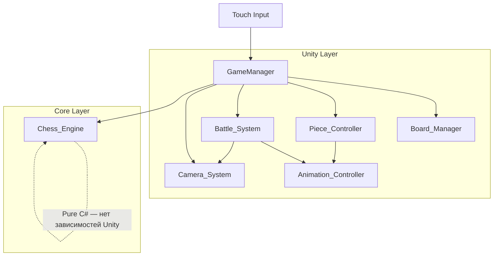
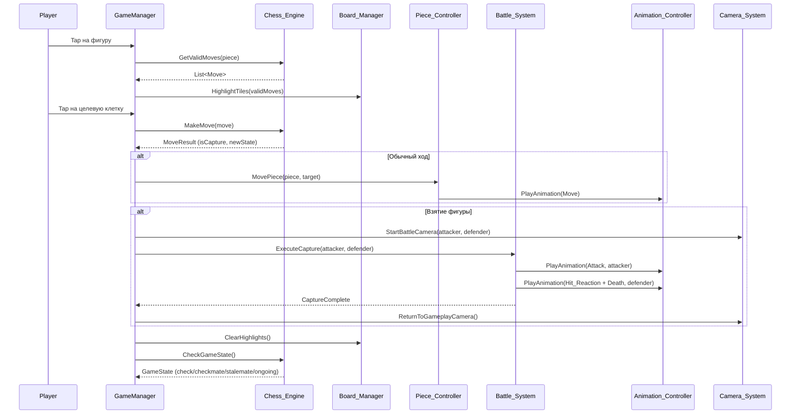

# Дизайн-документ: Wizard Chess Game

## Обзор

Wizard Chess Game — кроссплатформенная мобильная игра (iOS + Android) на Unity, реализующая полноценные шахматы с кинематографическими анимациями боёв в стиле волшебных шахмат. Архитектура строится на принципе модульности: чистый C# шахматный движок без зависимостей от Unity, отдельные системы для управления доской, фигурами, анимациями, боями и камерой. Стратегия Placeholder_Model позволяет вести разработку без финальных 3D-ассетов.

Ключевые технические решения:
- Chess_Engine как чистый C# модуль — тестируемость, переносимость, готовность к мультиплееру
- Tap-based управление — оптимизировано для мобильных устройств
- Система состояний анимации (5 состояний) — Idle, Move, Attack, Hit_Reaction, Death
- Battle_Animation 1.5–3 сек — баланс между зрелищностью и темпом игры
- Placeholder_Model стратегия — разработка логики параллельно с созданием ассетов

## Архитектура

### Общая архитектура

Система построена по принципу слоёв с чёткими границами ответственности:

```
┌─────────────────────────────────────────────────┐
│                  UI / Input Layer                │
│            (Touch Input, HUD, Menus)             │
├─────────────────────────────────────────────────┤
│              Game Controller Layer               │
│         (GameManager — координация)              │
├──────┬──────┬──────┬──────┬──────┬──────────────┤
│Board │Piece │Anim  │Battle│Camera│  Future:     │
│Mgr   │Ctrl  │Ctrl  │Sys   │Sys   │  Network_Mgr│
├──────┴──────┴──────┴──────┴──────┴──────────────┤
│            Chess_Engine (Pure C#)                │
│     (Rules, Validation, State, FEN)              │
└─────────────────────────────────────────────────┘
```

### Диаграмма взаимодействия модулей



### Поток хода игрока




## Компоненты и интерфейсы

### Chess_Engine (Pure C#)

Чистый C# модуль без зависимостей от UnityEngine. Это позволяет тестировать движок в изоляции, использовать его в серверном коде для мультиплеера и обеспечивает переносимость.

```csharp
// Основные типы
public enum PieceType { Pawn, Rook, Knight, Bishop, Queen, King }
public enum PieceColor { White, Black }
public enum GameState { Ongoing, Check, Checkmate, Stalemate }

public struct BoardPosition {
    public int File; // 0-7 (a-h)
    public int Rank; // 0-7 (1-8)
}

public struct ChessPiece {
    public PieceType Type;
    public PieceColor Color;
    public BoardPosition Position;
    public bool HasMoved;
}

public struct Move {
    public BoardPosition From;
    public BoardPosition To;
    public bool IsCapture;
    public bool IsCastling;
    public bool IsEnPassant;
    public PieceType? PromotionType;
}

public struct MoveResult {
    public bool Success;
    public bool IsCapture;
    public ChessPiece? CapturedPiece;
    public GameState NewGameState;
}

// Основной интерфейс движка
public interface IChessEngine {
    void InitializeBoard();
    void LoadFromFen(string fen);
    string ToFen();
    
    List<Move> GetValidMoves(BoardPosition piecePosition);
    MoveResult MakeMove(Move move);
    
    GameState GetGameState();
    PieceColor GetCurrentTurn();
    ChessPiece? GetPieceAt(BoardPosition position);
    List<ChessPiece> GetAllPieces(PieceColor color);
    
    bool IsInCheck(PieceColor color);
    bool IsCheckmate();
    bool IsStalemate();
}
```

Решение: Интерфейс `IChessEngine` позволяет подменять реализацию (например, для мультиплеера — прокси к серверу). Все типы — value types (struct) для минимизации аллокаций на мобильных устройствах.

### Board_Manager (Unity MonoBehaviour)

```csharp
public interface IBoardManager {
    void InitializeBoard();
    void HighlightValidMoves(List<Move> moves);
    void ClearHighlights();
    void PlacePiece(ChessPiece piece, BoardPosition position);
    void RemovePiece(BoardPosition position);
    
    Vector3 BoardToWorldPosition(BoardPosition pos);
    BoardPosition? WorldToBoardPosition(Vector3 worldPos);
    
    event Action<BoardPosition> OnTileClicked;
}
```

### Piece_Controller (Unity MonoBehaviour)

```csharp
public interface IPieceController {
    void SpawnPieces(List<ChessPiece> pieces);
    void SelectPiece(BoardPosition position);
    void DeselectPiece();
    IEnumerator MovePieceTo(BoardPosition target);
    void RemovePiece(BoardPosition position);
    void SetInputEnabled(bool enabled);
    
    GameObject GetPieceObject(BoardPosition position);
    
    event Action<BoardPosition> OnPieceSelected;
}
```

### Animation_Controller

```csharp
public enum AnimationState { Idle, Move, Attack, Hit_Reaction, Death }

public interface IAnimationController {
    void PlayAnimation(GameObject piece, AnimationState state);
    void PlayDeathEffect(GameObject piece, PieceType type);
    bool IsAnimationPlaying(GameObject piece);
    
    event Action<GameObject> OnAnimationComplete;
}
```

Конвенция именования анимаций: `{PieceType}_{AnimationState}` (например, `Pawn_Idle`, `Queen_Attack`).

### Battle_System

```csharp
public struct BattleConfig {
    public float MinDuration; // 1.5 сек
    public float MaxDuration; // 3.0 сек
}

public struct AttackStyle {
    public PieceType AttackerType;
    public string AnimationName;
    public string Description;
}

public interface IBattleSystem {
    IEnumerator ExecuteCapture(GameObject attacker, GameObject defender, 
                                PieceType attackerType, PieceType defenderType);
    AttackStyle GetAttackStyle(PieceType attackerType);
    bool IsBattleInProgress { get; }
    
    event Action OnBattleComplete;
}
```

Стили атаки по типу фигуры:
| Тип фигуры | Стиль атаки |
|---|---|
| Pawn | Быстрый удар копьём |
| Rook | Тяжёлый удар |
| Knight | Атака с разбега |
| Bishop | Магический луч |
| Queen | Комбо: ближний бой + магия |
| King | Мощный удар мечом |

Death_Effect по типу захваченной фигуры:
| Тип фигуры | Death_Effect |
|---|---|
| Pawn | Heavy Impact Fall / Stone Break |
| Rook | Stone Break |
| Knight | Heavy Impact Fall |
| Bishop | Magic Dissolve |
| Queen | Magic Dissolve + Stone Break |
| King | Уникальный драматический эффект |

### Camera_System

```csharp
public interface ICameraSystem {
    void SetGameplayView();
    IEnumerator TransitionToBattleView(Vector3 attackerPos, Vector3 defenderPos);
    IEnumerator ReturnToGameplayView();
    void ApplyCameraShake(float intensity, float duration);
}
```

### GameManager (координатор)

```csharp
public class GameManager : MonoBehaviour {
    // Зависимости (инжектируются через Inspector или DI)
    private IChessEngine chessEngine;
    private IBoardManager boardManager;
    private IPieceController pieceController;
    private IAnimationController animationController;
    private IBattleSystem battleSystem;
    private ICameraSystem cameraSystem;
    
    // Состояние
    private bool isProcessingMove;
    private BoardPosition? selectedPiecePosition;
}
```

Решение: GameManager — единственный координатор. Все модули общаются через него, не напрямую друг с другом. Это упрощает тестирование и замену модулей.
